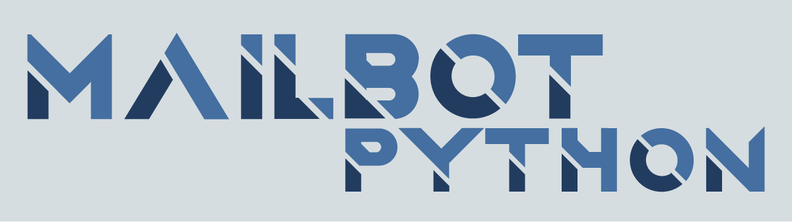

# Mail-BOT

Version actuelle : 




Un programme qui vous permet d'automatiser l'envoi de mails, utiles lorsqu'il faut chercher un stage, une alternance ou un travail.

## Sommaire
- [Installation](#installation)
- [Utilisation](#utilisation)
- [Versions](#versions)
- [License](#license)

## Installation

Dans la version qui vous interesse il faudra télécharger le fichier "**main.py**", et de suivre le README qui l'accompagne.

## Utilisation

Il faudra suivre le README de la version que vous utilisez

```bash
python main.py
```

## Versions

| N° Version | nouveauté |
|:----------:|----------|
| [1.0](./V1.0/README.md) |  Envoie des mails via un dictionnaire python. |
| [1.1](./V1.1/README.md) |  Envoi de mails via un fichier Excel et pouvoir de choisir des pièces-jointes selon le mail. |
| [1.2](./v1.2/README.md) | Toutes les variables pourront être remplies via le fichier Excel. Et le contenu du mail est dans un fichier txt |
| [1.3 (prochainement)](./v1.2/README.md) | intégration signature mail |

## License

```
MIT License

Copyright (c) 2023 Teo Gojkovic

Permission is hereby granted, free of charge, to any person obtaining a copy
of this software and associated documentation files (the "Software"), to deal
in the Software without restriction, including without limitation the rights
to use, copy, modify, merge, publish, distribute, sublicense, and/or sell
copies of the Software, and to permit persons to whom the Software is
furnished to do so, subject to the following conditions:

The above copyright notice and this permission notice shall be included in all
copies or substantial portions of the Software.

THE SOFTWARE IS PROVIDED "AS IS", WITHOUT WARRANTY OF ANY KIND, EXPRESS OR
IMPLIED, INCLUDING BUT NOT LIMITED TO THE WARRANTIES OF MERCHANTABILITY,
FITNESS FOR A PARTICULAR PURPOSE AND NONINFRINGEMENT. IN NO EVENT SHALL THE
AUTHORS OR COPYRIGHT HOLDERS BE LIABLE FOR ANY CLAIM, DAMAGES OR OTHER
LIABILITY, WHETHER IN AN ACTION OF CONTRACT, TORT OR OTHERWISE, ARISING FROM,
OUT OF OR IN CONNECTION WITH THE SOFTWARE OR THE USE OR OTHER DEALINGS IN THE
SOFTWARE.
```

## Auteur

[](https://github.com/Teo-Gojkovic)
